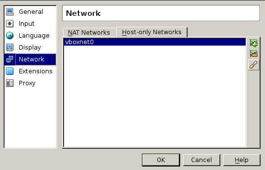
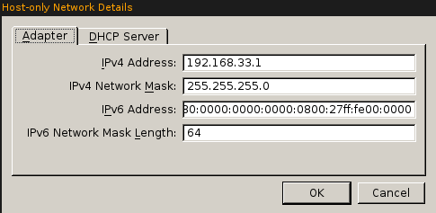
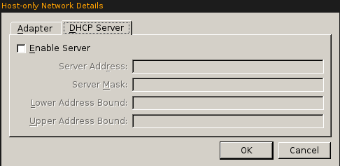
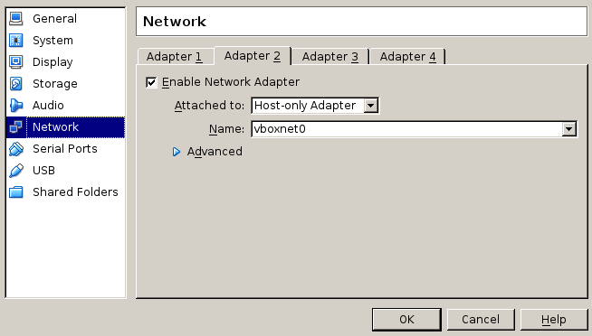
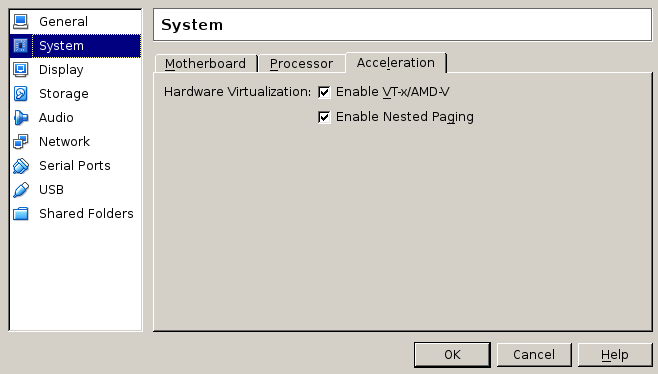
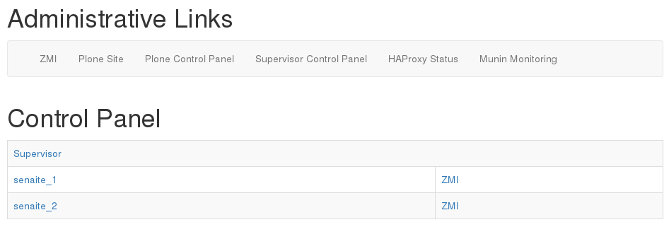
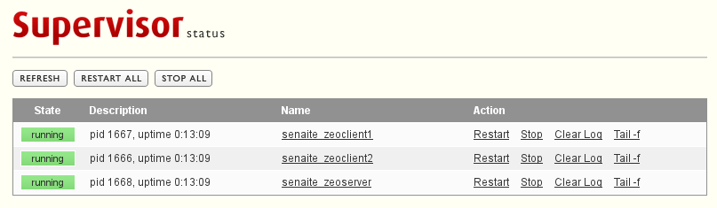
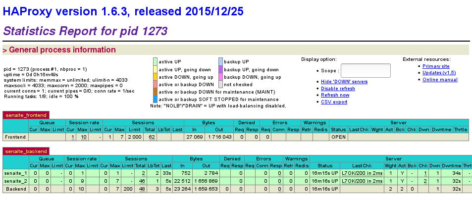
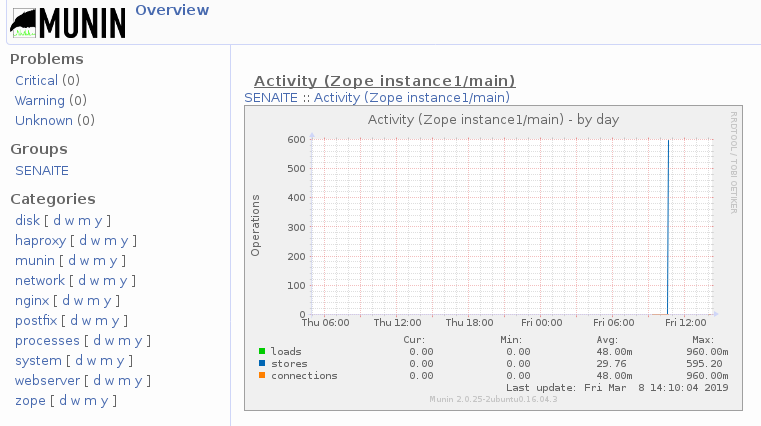

#  Installation of the ready-to-use Virtual Machine

## Introduction

This document comes as a quick-start guide for the ready-to-use SENAITE LIMS VM.

The Operating System in this Virtual Machine is an Ubuntu 16.04 Server LTS (also
known as xenial). The SENAITE instance, as well as the rest of tools the VM 
ships with, have been installed with [RedHat Ansible](https://www.ansible.com/).

The Ansible recipe, together with [instructions on how to build this Virtual
Machine from scratch](../ansible/README.md), can be found in this same 
repository, inside `ansible` folder.

Having a VM with all in place makes the deployment of full-fledged instances of
SENAITE easier, cause makes the system independent of infrastructure and there
is only the need to have a host with a virtualization software installed, also 
called an [hypervisor](https://en.wikipedia.org/wiki/Hypervisor).
 
[Virtual Box](https://www.virtualbox.org/) is an hypervisor widely used. Is
Open Source and can be used either for creating and running virtual machines in
local environments (with a graphical interface) or for server environments where
there is no graphical interface. Other hypervisors are VMware, Hyper-V, etc.

In this document, we will first cover the deployment of the VM in a local
environment by using VirtualBox client software. After this first deployment,
we will cover the basics on how to deploy SENAITE LIMS VM into a headless server
environment (debian/ubuntu-like). We will use VirtualBox hypervisor for both 
cases.

## Technical details

The Virtual Machine is shipped as an [Open Virtualization Format (OVF/OVA)
](https://en.wikipedia.org/wiki/Open_Virtualization_Format), an open, secure, 
portable, efficient and extensible format for the packaging and distribution of 
software to be run in virtual machines. This guarantees the VM can be deployed 
in most (if not all) hypervisors.

The following are the settings of the VM for BHP.LIMS:

- Ubuntu 16.04.5 LTS Server (Xenial) x64
- Hard disk: dynamic size, 2TB
- Processor: 2 cores
- RAM: 2048MB
- Language: English
- Location: Africa/Gaborone
- Networks:
  - Adapter 1 (enp0s3): NAT (dynamic assigned over DHCP)
  - Adapter 2 (enp0s8): host-only (vboxnet0, static 192.168.33.10)
- Hostname: senaite-xenial
- Username: senaite
- No automatic updates
- Open Ports: 22, 25, 80, 443
- LIMS System User (Linux): senaite
- LIMS Daemon User (Linux): senaite_daemon
- LIMS Installation Root: /home/senaite/senaitelims
- Database: /home/senaite/data/senaitelims
- DB Server (ZEO): 127.0.0.1:8100
- Instance 1 (ZOPE): 127.0.0.1:8081
- Instance 2 (ZOPE): 127.0.0.1:8082

Senaite instance is installed at `/home/senaite/senaitelims` and database files
at `/home/senaite/data`. User `senaite_daemon` is the effective user that runs 
the instance.

### Network

The VM has two network interfaces enabled. The first one (`enp0s3`) is a NAT, 
with dynamic assignment of IP over DHCP. The second is a host-only interface 
(`enp0s8`), bound to `vboxnet0` network (the one VirtualBox creates by default).
The IP for `vboxnet0` is 192.168.33.1, and the IP of the VM is configured 
statically to `192.168.33.10`. 

### Backups

The system has been configured with two cron jobs (run by `senaite_daemon`):

- `zeopack`: every Sunday at 01:30 AM
- `backup`: every day at 02:30 AM

Backups are stored in `/home/senaite/data/backups`, but system is configured to 
keep the last 5 backups (for filestorage) and blobs from the last 21 days. 
Hence, is strongly recommend to setup a `rsync` script in another machine to 
grab the backups from the VM in a regular basis.

Backups are incremental until the `zeopack` is run, so the system will keep 6
incremental backups (from Monday to Saturday) and one full backup each Sunday.

## Deployment in a local environment

If you don't have VirtualBox installed yet, download it from the official 
website: https://www.virtualbox.org/wiki/Downloads

Open VirtualBox and choose "File > Import Appliance" and select the Virtual
Machine provided (an .ova file). The VM needs to get imported into VirtualBox 
with the configured settings (Network, number of CPU's, RAM, etc.) as described 
in the "Technical Details" section.


### VirtualBox Network Settings

Ensure the Virtual Box itself has the Network properly configured. Go to
"File > Preferences > Network". Press "Host-only Networks" tab: `vboxnet0` 
adapter should be displayed:



If there is a network defined in there, but with another name, choose that
network and press edit button (third button from the right, a screwdriver) and 
rename it to `vboxnet0`. If there is no network defined there, press the first 
button (add) and name it `vboxnet0`.

Choose `vboxnet0` and press the edit button (screwdriver icon). Ensure the IPv4
 Address is `192.168.33.1` and IPV4 Network Mask is `255.255.255.0`. The 
 configuration of this network should look similar to:





*Note DHCP Server is disabled for Host-only adapter*

To validate the VirtualBox Network Settings, run the command 
`$ sudo ifconfig -a` (Mac/Linux) or `ipconfig /all` (Windows):

```sh
lynn:~$ sudo ifconfig -a
eth0      Link encap:Ethernet  HWaddr 68:f7:28:76:fd:39  
          UP BROADCAST MULTICAST  MTU:1500  Metric:1
          RX packets:0 errors:0 dropped:0 overruns:0 frame:0
          TX packets:0 errors:0 dropped:0 overruns:0 carrier:0
          collisions:0 txqueuelen:1000 
          RX bytes:0 (0.0 B)  TX bytes:0 (0.0 B)
          Interrupt:20 Memory:f1200000-f1220000 

lo        Link encap:Local Loopback  
          inet addr:127.0.0.1  Mask:255.0.0.0
          inet6 addr: ::1/128 Scope:Host
          UP LOOPBACK RUNNING  MTU:65536  Metric:1
          RX packets:415638 errors:0 dropped:0 overruns:0 frame:0
          TX packets:415638 errors:0 dropped:0 overruns:0 carrier:0
          collisions:0 txqueuelen:0 
          RX bytes:1686276437 (1.5 GiB)  TX bytes:1686276437 (1.5 GiB)

vboxnet0  Link encap:Ethernet  HWaddr 0a:00:27:00:00:00  
          inet addr:192.168.33.1  Bcast:192.168.33.255  Mask:255.255.255.0
          inet6 addr: fe80::800:27ff:fe00:0/64 Scope:Link
          UP BROADCAST RUNNING MULTICAST  MTU:1500  Metric:1
          RX packets:0 errors:0 dropped:0 overruns:0 frame:0
          TX packets:1814 errors:0 dropped:0 overruns:0 carrier:0
          collisions:0 txqueuelen:1000 
```


### Virtual Machine Network Settings

It is absolutely important that the VM is configured with **two network adapters**.
*Adapter 1* as NAT and *Adapter 2* as Host-only adapter for the network 
192.168.33.0. You can check if it has been properly configured by right-click on
the Virtual Machine and select the "Network" section:




See https://www.virtualbox.org/manual/ch06.html#network_hostonly
for further details about configuring a host-only adapter.

### Start the Virtual Machine

Select the Virtual Machine in VirtualBox and press the "Start" button. You
should see the login screen of the Ubuntu Server:

```
Ubuntu 16.04.6 LTS senaite-xenial tty1

senaite-xenial login:

```

**You don't need to login to the server, because all the services started
automatically in the background**

If instead, you get a message similar to:

```
VT-x is not available (VERR_VMX_NO_VMX).

Result Code:
E_FAIL (0x80004005)
Component:
ConsoleWrap
Interface:
IConsole {872da645-4a9b-1727-bee2-5585105b9eed}
```

The Virtualization option might be not enabled for the CPU in the local 
machine's BIOS and this is required since Senaite Virtual Machine guest OS 
(Ubuntu) is 64-bit. You need to enable the Virtualization option in the local
machine's BIOS and restart the computer. If the BIOS does not have a
Virtualization option or it is already enabled, try to disable the option
"Enable VT-x/AMD-V" under "Setings > System > Acceleration":



If the problem still persists, you might try reducing the Virtual Machine memory
under "Settings > System", and reduce the cores to 1.

### Accessing to the VM through https

Open a browser in your computer and enter https://192.168.33.10 into the address
bar to access the SENAITE LIMS system and the login page. Note this IP is only
available on the VM Host.

**Important:** Please confirm in your browser the security message regarding the
self-signed security certificate and login with the username and password
provided.

### Services

The VM provides administrative links directly through the web interface.

#### Control Panel

The control panel provides an overview of the installed services and allows a
quick navigation to their administrative sites, as well as the direct access to
the single Zope instances.

http://192.168.33.10/control_panel



This page has no access restriction, but the links to each page are secured and
only accessible via Basic Authentication over HTTPS.

#### Supervisor

[Supervisor](http://supervisord.org) allows starting and stopping the LIMS
instances and the DB server. It manages the database ZEO Servers  
(`senaitelims_zeoserver`), as well as the 2 connected ZOPE instances 
(`senaitelims_zeoclient1`, `senaitelims_zeoclient2`).

https://192.168.33.10/supervisor




#### HAProxy

[HAProxy](http://www.haproxy.org) is a load balancer which distributes incoming 
requests equally to the available LIMS instances.

https://192.168.33.10/haproxy-status




#### Munin

[Munin](http://munin-monitoring.org) is a monitoring tool which monitors the
SENAITE LIMS installation, as well as other relevant services of the system.

https://192.168.33.10/munin




## Deployment in a server environment

For the deployment in server environment we will mostly use `vboxmanage` tool
from command line, allowing us to configure and manage virtual machines without
graphical interface.

The present document is meant to be used as a quick/start guide to deploy the 
Virtual Machine in a server environment rapidly, so it might not cover specific
issues or configurations from/for your environment. Hence, we strongly recommend
to take a look to the well-written and extensive official documentation about 
VirtualBox, and pay special attention to 
[Chapter 8. VBoxManage](https://www.virtualbox.org/manual/ch08.html), the main
reference resource for deployment and management of headless Virtual Machines in
server environments. 


## Install VirtualBox Headless

For the installation of VirtualBox (headless), please refer to the official 
documentation: [Chapter 2. Installation Details](https://www.virtualbox.org/manual/ch02.html)

If you have VirtualBox already installed, the following command should list the
virtual machines registered in the system:

```sh
$ vboxmanage list vms
```

In case you get the following message instead of an empty list or a list with
the registered Virtual Machines:

```
WARNING: The vboxdrv kernel module is not loaded. Either there is no module
         available for the current kernel (4.9.0-6-amd64) or it failed to
         load. Please recompile the kernel module and install it by

           sudo /sbin/vboxconfig

         You will not be able to start VMs until this problem is fixed.
```

You have to tell VirtualBox to build the modules for the installed kernel by
running the command below:

```sh
$ sudo /sbin/vboxconfig
Created symlink /etc/systemd/system/multi-user.target.wants/vboxdrv.service → /lib/systemd/system/vboxdrv.service.
Created symlink /etc/systemd/system/multi-user.target.wants/vboxballoonctrl-service.service → /lib/systemd/system/vboxballoonctrl-service.service.
Created symlink /etc/systemd/system/multi-user.target.wants/vboxautostart-service.service → /lib/systemd/system/vboxautostart-service.service.
Created symlink /etc/systemd/system/multi-user.target.wants/vboxweb-service.service → /lib/systemd/system/vboxweb-service.service.
vboxdrv.sh: Stopping VirtualBox services.
vboxdrv.sh: Starting VirtualBox services.
vboxdrv.sh: Building VirtualBox kernel modules.
```

If instead, you get:

```sh
$ sudo /sbin/vboxconfig
Created symlink /etc/systemd/system/multi-user.target.wants/vboxdrv.service → /lib/systemd/system/vboxdrv.service.
Created symlink /etc/systemd/system/multi-user.target.wants/vboxballoonctrl-service.service → /lib/systemd/system/vboxballoonctrl-service.service.
Created symlink /etc/systemd/system/multi-user.target.wants/vboxautostart-service.service → /lib/systemd/system/vboxautostart-service.service.
Created symlink /etc/systemd/system/multi-user.target.wants/vboxweb-service.service → /lib/systemd/system/vboxweb-service.service.
vboxdrv.sh: Stopping VirtualBox services.
vboxdrv.sh: Building VirtualBox kernel modules.
vboxdrv.sh: Starting VirtualBox services.
vboxdrv.sh: Building VirtualBox kernel modules.
vboxdrv.sh: failed: modprobe vboxdrv failed. Please use 'dmesg' to find out why.

There were problems setting up VirtualBox.  To re-start the set-up process, run
  /sbin/vboxconfig
as root
```

Then, the server BIOS is configured to boot to UEFI mode (instead of Legacy
BIOS mode or MBR). When UEFI mode is enabled, all kernel must be signed by a key
trusted by UEFI system, but the OS installed in your server does not sign third
party `vbox*` kernel modules. Hence, it fails. 

The recommended way to fix this problem is to restart the server, enter to BIOS 
and disable UEFI mode and/or disable Secure Boot.

If you don't have the chance to modify this setting in BIOS, an alternative
would be to create your own RSA certificate and sign the kernel modules with it,
as suggested [here](https://askubuntu.com/questions/900118/vboxdrv-sh-failed-modprobe-vboxdrv-failed-please-use-dmesg-to-find-out-why#answer-900121).


### Import the Virtual Machine (.ova)

The first step is to import the Open Virtual Appliance file. Copy the .ova file 
somewhere in the server (e.g. your user's /home directory) and do the import:

```sh
$ vboxmanage import senaite_vm.ova
```

The output should look similar to the following:

```
0%...10%...20%...30%...40%...50%...60%...70%...80%...90%...100%
Interpreting /home/lims/senaite_vm.ova...
OK.
Disks:
  vmdisk3	2199022206976	-1	http://www.vmware.com/interfaces/specifications/vmdk.html#streamOptimized	senaite_vm-disk1.vmdk	-1	-1	

Virtual system 0:
 0: Suggested OS type: "Ubuntu_64"
    (change with "--vsys 0 --ostype <type>"; use "list ostypes" to list all possible values)
 1: Suggested VM name "senaite_vm"
    (change with "--vsys 0 --vmname <name>")
 2: Number of CPUs: 2
    (change with "--vsys 0 --cpus <n>")
 3: Guest memory: 2000 MB
    (change with "--vsys 0 --memory <MB>")
 4: USB controller
    (disable with "--vsys 0 --unit 4 --ignore")
 5: Network adapter: orig NAT, config 3, extra slot=0;type=NAT
 6: Network adapter: orig HostOnly, config 3, extra slot=1;type=HostOnly
 7: CD-ROM
    (disable with "--vsys 0 --unit 7 --ignore")
 8: IDE controller, type PIIX4
    (disable with "--vsys 0 --unit 8 --ignore")
 9: IDE controller, type PIIX4
    (disable with "--vsys 0 --unit 9 --ignore")
10: SATA controller, type AHCI
    (disable with "--vsys 0 --unit 10 --ignore")
11: Hard disk image: source image=senaite_vm-disk1.vmdk, target path=/home/lims/VirtualBox VMs/senaite_vm/senaite_vm-disk1.vmdk, controller=10;channel=0
    (change target path with "--vsys 0 --unit 11 --disk path";
    disable with "--vsys 0 --unit 11 --ignore")
0%...10%...20%...30%...40%...50%...60%...70%...80%...90%...100%
Successfully imported the appliance.
```

At this point, the system imported the appliance, so the Virtual Machine has
been registered in Virtual Box:

```sh
$ vboxmanage list vms
"senaite_vm" {8ffdf553-21bf-437e-bdea-13907ed80b66}
```

You can also check the Virtual Machine details with the following command:

```sh
$ vboxmanage showvminfo senaite_vm
```

At this point, you can run the virtual machine in headless mode like this:

```sh
$ vboxmanage startvm senaite_vm --type headless
```

The virtual machine will start. If instead, you get the following message:

```
VBoxManage: error: Nonexistent host networking interface, name 'vboxnet0' (VERR_INTERNAL_ERROR)
VBoxManage: error: Details: code NS_ERROR_FAILURE (0x80004005), component ConsoleWrap, interface IConsole
```

Then, you need to setup the hostonly network `vboxnet0` first, as explained in
[Network settings section below](#network-settings).

You can check the Virtual Machines that are running with the following command:

```sh
$ vboxmanage list runningvms
```

To stop the Virtual Machine:

```sh
vboxmanage controlvm senaite_vm acpipowerbutton
```

### Network settings

As discussed previously, the Virtual Machine is configured with two network 
adapters: *Adapter 1* as NAT and *Adapter 2* as Host-only adapter for the 
network 192.168.33.0. Hence, we need first to ensure the host-only network is
configured properly: 

```sh
$ vboxmanage hostonlyif create
$ vboxmanage hostonlyif ipconfig vboxnet0 --ip 192.168.33.1 --netmask 255.255.255.0
```

Further info: 
- *[6.7 Host-Only Networking](https://www.virtualbox.org/manual/ch06.html#network_hostonly)*
- *[8.38 VBoxManage hostonlyif](https://www.virtualbox.org/manual/ch08.html#vboxmanage-hostonlyif)*


### Add more RAM to the Virtual Machine

The ready-to-use Virtual Machine comes with only 2048 MB of RAM. Althought this
might be enough for personal use or testing environments, we strongly suggest
to increase the RAM to at least 16 GB (32 GB recommended). 

The following command sets the amount of RAM, in MB, that the virtual machine 
should allocate for itself from the host

```sh
$ vboxmanage modifyvm senaite_vm --memory 32000 
```

Further info: *[8.8 VBoxManage modifyvm](https://www.virtualbox.org/manual/ch08.html#vboxmanage-modifyvm)*


### SSH access to the Virtual Machine

From the host itself, you can access to the Virtual Machine through SSH:

```sh
$ ssh senaite@192.168.33.10
senaite@192.168.33.10's password: 
Welcome to Ubuntu 16.04.6 LTS (GNU/Linux 4.4.0-142-generic x86_64)

 * Documentation:  https://help.ubuntu.com
 * Management:     https://landscape.canonical.com
 * Support:        https://ubuntu.com/advantage

8 packages can be updated.
0 updates are security updates.


*** System restart required ***
Last login: Fri Mar  8 10:40:34 2019 from 192.168.33.1
```

If you want to grant direct SSH access to the Virtual Machine from outside the
host, you need to tunnel SSH requests to the server for a given port (e.g 2220)
to the the Virtual Machine's SSH port. In the host, run the following commands:

```sh
$ vboxmanage modifyvm senaite_vm --natpf1 "ssh,tcp,,2222,,22"
```

*Note that `open-ssh` needs to be installed in the host and the port 2222 open.*

Further info: *[6.3.1 Configuring Port Forwarding with NAT](https://www.virtualbox.org/manual/ch06.html#natforward)*

Now, you should be able to access directly to the Virtual Machine through SSH 
from outside the host:

```sh
$ ssh myserver -p2222 senaite@my_host_ip
```

*Remember to replace `my_host_ip` with the IP of your host*


### Redirect http requests to Virtual Machine

This can be done the same way we've discussed for SSH tunneling in previous 
section, but for 443 https port. Nevertheless, we strongly recommend to keep the
Virtual Machine as much encapsulated as possible for security reasons. 

Therefore, we strongly suggest to setup a nginx server (if not yet) in the host 
to handle all the requests. Then, configure a virtual host properly, so it
proxies the requests from outside to the Virtual Machine:

```
    location / {
        proxy_pass https://192.168.33.10;
        proxy_set_header        X-Forwarded-Proto https;
        proxy_set_header        Host            $host;
        proxy_set_header        X-Real-IP       $remote_addr;
        proxy_set_header        X-Forwarded-For $proxy_add_x_forwarded_for;
        proxy_ssl_verify off;
    }

```
